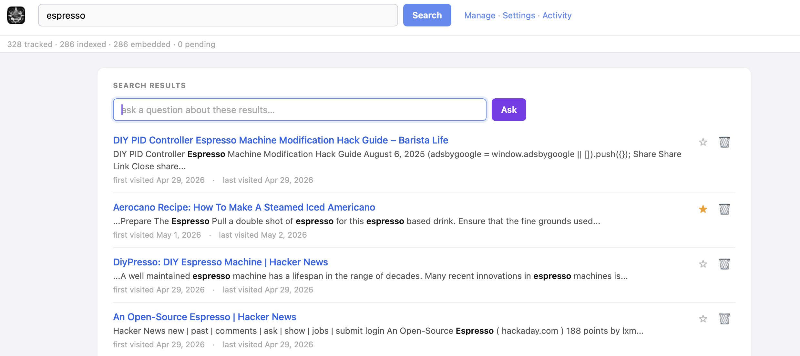
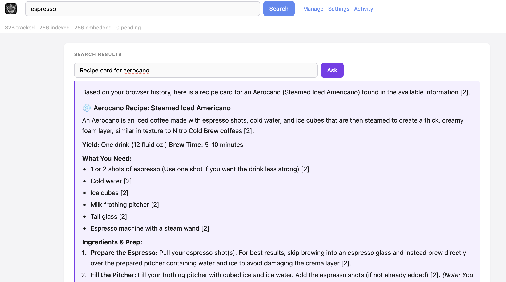
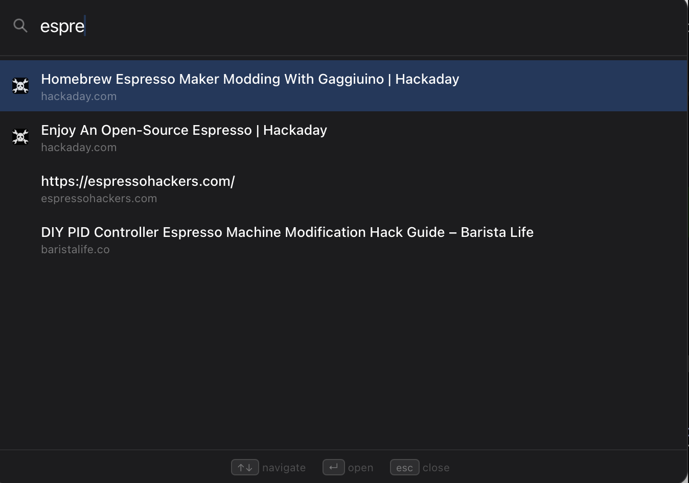

# memoir

Your browser history is a personal library built up over years of reading — documentation, articles, discussions, research, notes. memoir turns it into a searchable, queryable knowledge base that lives entirely on your machine.

No extension. No cloud. No subscription. Just your history, indexed and searchable.

---

## Why memoir?

You've read the answer to this problem before. You just can't find it.

It's in a tab you closed six months ago, or a Hacker News thread from last year, or documentation you bookmarked and forgot. Your browser's built-in history search only matches URLs and titles — not the actual content of pages you visited.

memoir fetches and indexes the full text of the pages in your history. Then you can search them like you'd search a codebase: by what the pages *said*, not just what they were called.

It also embeds everything with a local ML model so you can search by meaning ("how does Rust handle async cancellation") instead of keywords. And if you have a local LLM running, you can ask questions directly and get answers grounded in pages you've actually read.

Everything runs on your computer. memoir never sends your history, your queries, or your pages anywhere.

---
Search:
<a href="screenshots/search.png"></a> 

Asked and answered:
<a href="screenshots/ask.png"></a> 

Hotkey popup:
<a href="screenshots/hotkey.png"></a>

---

## Features

**Search**
- Full-text search over fetched page content via SQLite FTS5 with BM25 ranking
- Highlighted snippets showing where your query matched
- Semantic search using local embeddings (BAAI/bge-small-en-v1.5, 384 dimensions)
- Falls back to URL substring matching for short or URL-like queries
- Live search as you type

**Ask**
- Ask questions in natural language; answers are grounded in pages from your history
- Works with LM Studio, Ollama, OpenAI, or the Anthropic API
- Returns source URLs alongside the answer
- Fully optional — all other features work without a running LLM

**Quick Palette**
- Press **⌘⇧Space** anywhere to open a floating search palette
- Results appear inline as you type — no need to open a full browser tab
- Press Escape or click outside to dismiss

**Manage**
- Browse your entire index with search and pagination
- Star pages to save them permanently
- Delete individual URLs or entire hosts from the index
- Ban a host to prevent it from being indexed in the future
- See visit counts, first/last visit times, and fetch status per page

**Clusters**
- Groups your browsing into sessions by time proximity
- Shows what you were researching on a given day
- Domains can be ignored so they don't dominate cluster views

**Starred Pages**
- Curate a reading list separate from your raw history
- Export your starred pages as JSON
- Import starred pages from a JSON file (useful for migrating between machines)

**Orion Reading List**
- If you use Orion Browser, memoir automatically indexes your Reading List items alongside your history

**MCP Server**
- Run memoir as a Model Context Protocol server over stdio
- Exposes `search`, `ask`, and `starred` tools to any MCP-compatible client
- Lets your AI assistant query your personal history index directly

**Activity Log**
- In-memory log of sync events, searches, Ask queries, and errors for the current session
- Accessible at `/log` — filterable by category (Sync, Search, Ask, Errors)
- Polls live every two seconds; click any entry with detail to expand it

**Desktop App (macOS)**
- Native Tauri app — lives in the menu bar
- Auto-starts the sync loop in the background
- Setup wizard on first launch: detects your browser, tests LLM connectivity
- Sync on demand from the tray menu, or let it run automatically every N minutes

**Privacy**
- Runs entirely on your machine
- Never reads your browser's live history file — copies it to a temp file first
- Never modifies your browser data
- No analytics, no telemetry, no network calls except to fetch pages you already visited

---

## Requirements

- macOS 12+
- Rust 1.85+ (for building from source; not needed if you download a release)
- A supported browser
- Optionally: LM Studio, Ollama, or another OpenAI-compatible server for the `/ask` feature

---

## Browser support

| Browser | `kind` value | Notes |
|---------|-------------|-------|
| [Orion](https://browser.kagi.com) | `orion` | Default. Reading List is also indexed |
| Chrome | `chrome` | |
| Brave | `brave` | |
| Arc | `arc` | |
| Edge | `edge` | |
| Chromium | `chromium` | Any Chromium-based build |

---

## LLM support

memoir uses the OpenAI-compatible `/v1/chat/completions` endpoint by default, and the Anthropic Messages API when `provider = "anthropic"`. The LLM is optional — full-text search and semantic search work without it.

| Server | `provider` value | Notes |
|--------|-----------------|-------|
| [LM Studio](https://lmstudio.ai) | `lm_studio` | Default. memoir auto-loads the model at startup via the LM Studio REST API |
| [Ollama](https://ollama.com) | `lm_studio` | Point `base_url` at `http://localhost:11434` |
| Any OpenAI-compatible server | `openai` | Set `base_url` and `model` in config |
| OpenAI | `openai` | Set `api_key`, `base_url = "https://api.openai.com"`, and `model` |
| Anthropic API | `anthropic` | Set `api_key`, `base_url = "https://api.anthropic.com"`, and `model` |

---

## Installation

### Download a release (macOS)

1. Download the `.dmg` from the [Releases](../../releases) page
2. Open the DMG and drag **Memoir.app** to your Applications folder
3. **First launch:** right-click the app and choose **Open** (macOS Gatekeeper blocks unsigned apps on double-click)
4. After the first open, you can launch it normally

> **Gatekeeper note:** memoir is not signed with an Apple Developer certificate. macOS will show a warning the first time. Right-click → Open bypasses this. Alternatively: `xattr -dr com.apple.quarantine /Applications/Memoir.app`

Once installed, Memoir can update itself — use **Check for Updates…** in the menu bar icon menu.

### Build from source

```sh
# Install Rust (if you don't have it)
curl --proto '=https' --tlsv1.2 -sSf https://sh.rustup.rs | sh

# Install Tauri CLI
cargo install tauri-cli --version "^2"

git clone https://github.com/your-username/memoir
cd memoir
cargo tauri build
```

The built `.app` bundle appears in `src-tauri/target/release/bundle/macos/`.

### CLI only (no desktop app)

```sh
cargo build --release --bin memoir
cp target/release/memoir /usr/local/bin/memoir
```

The first run downloads the embedding model (~130 MB from HuggingFace) and caches it in the data directory.

---

## Getting started

On first launch, the setup wizard opens automatically and walks through:

1. **Browser detection** — finds your history database
2. **LLM configuration** — test your local LLM connection (optional)
3. **Initial sync** — indexes your recent history

After setup, memoir syncs in the background every 60 minutes (configurable). You can trigger a sync at any time from the tray menu.

---

## Desktop app

The Tauri app starts automatically and keeps running in the menu bar after the window is closed.

**Tray menu:**

| Item | Action |
|------|--------|
| Open Memoir | Show the main window |
| Sync Now | Run a sync immediately |
| Pause Sync / Resume Sync | Toggle the background sync loop |
| Quit | Exit the app |

**Keyboard shortcut:** Press **⌘⇧Space** anywhere to open the search palette. Results appear live as you type. The shortcut is configurable via `application.hotkey` in `config.toml`.

---

## CLI usage

**Sync** — fetch and index pages from your recent history:

```sh
memoir sync
```

**Serve** — start the web interface only:

```sh
memoir
```

Then open [http://localhost:3000](http://localhost:3000).

Pass `--no-sync` to skip the background sync loop (useful if you only want the UI or are running sync separately):

```sh
memoir --no-sync
```

Pass `--config-dir <path>` to use a config directory other than the default:

```sh
memoir --config-dir /path/to/config
```

### As a new tab page

In Orion: **Settings → New Tab → Custom URL → `http://localhost:3000`**

---

## MCP integration

memoir implements a [Model Context Protocol](https://modelcontextprotocol.io/) server. Two transports are supported — use whichever fits your client.

### HTTP transport (recommended when memoir is already running)

The MCP endpoint is built into the web server at `POST /mcp`. No separate process needed — if memoir is running, MCP is running.

```json
{
  "mcpServers": {
    "memoir": {
      "type": "http",
      "url": "http://localhost:3000/mcp"
    }
  }
}
```

### stdio transport

memoir also speaks MCP over stdin/stdout. The client spawns memoir as a subprocess and pipes messages to it. The full web server and sync loop start alongside the MCP handler.

```json
{
  "mcpServers": {
    "memoir": {
      "command": "/usr/local/bin/memoir",
      "args": ["--no-sync"]
    }
  }
}
```

> **`--no-sync`** prevents a second sync process when memoir is already running as the desktop app. Omit it if this is your only memoir instance.

Config file location for Claude Desktop: `~/Library/Application Support/Claude/claude_desktop_config.json`

### Available tools

| Tool | Description |
|------|-------------|
| `search` | Full-text + semantic search over your indexed history |
| `ask` | Ask a question; returns an LLM answer grounded in your history |
| `get_page` | Retrieve the full stored content of a page by URL |
| `get_recent` | List recently visited pages, newest first |
| `get_starred` | Retrieve your starred/bookmarked pages |

---

## API reference

The web interface is backed by a local Axum server. You can call it directly from other tools.

| Method | Path | Description |
|--------|------|-------------|
| `GET` | `/` | Start page (recent history + starred) |
| `GET` | `/manage` | Manage page (browse, star, delete, ban) |
| `GET` | `/settings` | Settings page |
| `GET` | `/setup` | Setup wizard |
| `GET` | `/palette` | Quick search palette |
| `GET` | `/health` | Health check |
| `POST` | `/mcp` | MCP JSON-RPC endpoint (HTTP transport) |
| `GET` | `/api/recent?limit=20` | Recently visited pages |
| `GET` | `/api/top-sites?limit=20` | Most visited pages |
| `GET` | `/api/search?q=…&limit=20` | Full-text + semantic search |
| `GET` | `/api/ask?q=…&k=5` | Ask a question (requires LLM + embedder) |
| `GET` | `/api/stats` | Index counts |
| `GET` | `/api/pages?limit=50&offset=0&q=…` | Browse all indexed pages |
| `GET` | `/api/starred?limit=20` | Starred pages |
| `POST` | `/api/star?url=…&starred=true` | Star or unstar a page |
| `DELETE` | `/api/page?url=…` | Delete a single page |
| `DELETE` | `/api/host?host=…` | Delete all pages for a host |
| `POST` | `/api/ban` | Ban a host (body: `{"host":"example.com"}`) |
| `POST` | `/api/bookmark` | Bookmark a URL (body: `{"url":"…","title":"…"}`) |
| `GET` | `/api/favicon?host=…` | Serve cached favicon |
| `GET` | `/api/clusters?days=14` | Browsing session clusters |
| `POST` | `/api/clusters/ignore` | Ignore a domain in cluster view |
| `DELETE` | `/api/clusters/ignore` | Unignore a domain |
| `GET` | `/api/export/starred` | Download starred pages as JSON |
| `POST` | `/api/import/starred` | Import starred pages from JSON |
| `POST` | `/api/sync` | Trigger a sync |
| `GET` | `/api/sync/status` | Sync status and interval |
| `POST` | `/api/sync/pause?paused=true` | Pause or resume sync |
| `GET` | `/api/settings` | Get current settings |
| `POST` | `/api/settings` | Save settings |
| `GET` | `/api/open-url?url=…` | Open a URL in the default browser |
| `GET` | `/log` | Activity log page |
| `GET` | `/api/log?kind=…` | Session log entries (all, or filtered by `sync`/`search`/`llm`/`error`) |

**Search response:**

```json
[
  {
    "url": "https://doc.rust-lang.org/book/",
    "title": "The Rust Programming Language",
    "snippet": "…ownership and <b>borrowing</b> rules…",
    "rank": -1.234,
    "first_visit_at": "2024-11-01T09:00:00Z",
    "last_visit_at": "2025-03-15T14:22:00Z",
    "starred": false
  }
]
```

**Ask response:**

```json
{
  "answer": "Ownership in Rust means each value has a single owner…",
  "sources": ["https://doc.rust-lang.org/book/ch04-01-what-is-ownership.html"]
}
```

`/api/ask` returns `503` if the embedding model is unavailable, and `{"answer": "No relevant pages found.", "sources": []}` if no indexed pages match.

---

## Browser button

Star the current page you are on and start its import from the click of a button in a browser.

`window.fetch('http://127.0.0.1:3000/api/bookmark?url=' + encodeURIComponent(location.href) + '&title=' + encodeURIComponent(document.title), { method: 'POST' })`

## Data

memoir stores everything in `~/.memoir/`:

| File | Contents |
|------|----------|
| `index.db` | SQLite database — page text, FTS5 index, embeddings, starred flags, ban list, favicons |
| `config.toml` | Configuration (created by setup wizard or edited manually — see [CONFIG.md](CONFIG.md)) |

The browser history database is never modified. memoir copies it to a temp file before reading.

---

## Configuration

See **[CONFIG.md](CONFIG.md)** for the full reference. Defaults are compiled in. Create `~/.memoir/config.toml` to override:

```toml
[application]
host = "127.0.0.1"
port = 3000

[data]
dir = "~/.memoir"

[browser]
history_db_path = "~/Library/Application Support/Orion/Defaults/history"
kind = "orion"   # orion | chrome | brave | arc | edge | chromium

[fetch]
delay_ms = 200
timeout_secs = 15
ban = ["web.archive.org", "mail.google.com"]
# custom_css = ""   # CSS applied to all pages — see HTML.md for available classes

[llm]
provider = "lm_studio"              # lm_studio | openai | anthropic
base_url = "http://localhost:1234"  # LM Studio default
model = "local-model"               # must match the model key in LM Studio
# api_key = "sk-..."                # required for OpenAI / Anthropic

[sync]
interval_mins = 60
```

The sync interval is re-read each cycle, so changes take effect without restarting the app.

For the full option reference see [CONFIG.md](CONFIG.md). For CSS class names available for `custom_css` see [HTML.md](HTML.md).

---

## How it works

1. **Sync** reads the 1,000 most recent URLs from your browser's SQLite history, registers any new ones, then fetches and extracts text from each page — respecting a configurable crawl delay, skipping auth walls and non-HTML content. URLs that fail 3 times are marked and no longer retried.

2. Fetched pages are stored in `index.db` and inserted into an FTS5 virtual table for BM25-ranked full-text search.

3. After fetching, the embedding model (BAAI/bge-small-en-v1.5 via ONNX Runtime) encodes each page's title + body into a 384-dimensional vector stored as a BLOB. The model runs entirely locally.

4. **Search** queries the FTS5 index and returns ranked results with highlighted snippets. Semantic search re-ranks results using cosine similarity (minimum score: 0.3).

5. **Ask** embeds the query, retrieves the top-*k* pages by cosine similarity and BM25, builds a context prompt from the page bodies, and calls the configured LLM.

6. **Clusters** groups your visit history into sessions by time proximity, letting you see what you were researching on any given day.

7. **Desktop app**: the Axum server runs inside the Tauri process. The WebView points at `http://127.0.0.1:<port>`. A background task runs the sync loop, re-reading config each cycle.

---

## License

MIT
